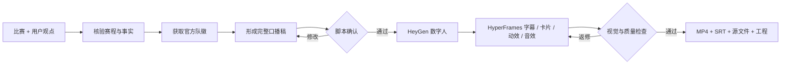

# Football Prediction Avatar Video

一个面向 Codex 的中文足球预测数字人成片 Skill：从用户的一条赛前观点出发，联网核验赛程与近期事实，确认完整口播稿，生成数字人，再完成官方队徽、单行字幕、赛事信息卡、动效、音效与最终质检。

默认交付：**9:16、1080 × 1920、H.264 MP4 + 独立 SRT + 可编辑 HyperFrames 工程**。

## 背景概述

足球预测短视频不只是把一段文字交给数字人。赛事时间、主客顺序、伤停和球队状态会变化；队徽需要可信来源；口播观点不能被模型悄悄改写；数字人生成又涉及费用与身份素材。一旦字幕、画面卡片和声音不同步，成片即使“看起来完整”也很难直接发布。

这个 Skill 把研究、脚本、生成、剪辑和验收组合成一条带审批门的可复现流程。用户的预测是编辑方向，事实需要独立核验，付费生成和最终渲染则必须在相应条件通过后才能继续。

## 解决的问题

| 生产风险 | Skill 的处理方式 |
| --- | --- |
| 赛程、主客场或球队信息错误 | 优先核验俱乐部、联赛、赛事与足协等一手来源 |
| 搜索图或旧队徽被误当官方素材 | 保存来源、日期、文件哈希和证据等级并自动校验 |
| AI 擅自改变用户观点或比分 | 展示完整口播稿，修改后重新获得明确确认 |
| 数字人自带字幕导致后期重复 | 要求生成干净、无字幕的竖屏数字人源视频 |
| 字幕、卡片、音效各自对不准 | 让视觉元素绑定同一段口播时间，并在渲染前检查 |
| 画面信息过多遮挡数字人 | 保持数字人为主画面，限制大卡片数量和停留时间 |
| 交付文件命名不清、不可复用 | 同时保留最终 MP4、SRT、干净源视频、研究记录和工程文件 |

## 完整工作流



## 成品效果

默认成片采用稳定的竖屏足球口播结构：

```text
┌──────────────────────────┐
│ 赛事名   队徽  主队 VS 客队  队徽 │  ← 顶部对阵条
├──────────────────────────┤
│                          │
│        数字人口播主画面       │
│                          │
│  [近期状态 / 战术 / 关键球员卡] │  ← 只在对应口播出现
│                          │
│      单行中文语义字幕          │
└──────────────────────────┘
```

- 数字人保持主视觉，脸部不被对阵条和信息卡遮挡。
- 赛事事实、伤停和关键数据只在口播确实提及时出现。
- 字幕按自然语义分组，不逐字蹦出，也不重复覆盖两层字幕。
- 卡片使用短促入场动效，队徽与数据落点配合克制音效。
- 结尾清楚呈现预测观点，同时保留不确定性说明。

仓库提供的是生产 Skill 与质量规范，不包含真实人物照片、克隆声音或具体比赛成片；这些素材必须由使用者提供、授权或在单次任务中按来源规则取得。

## 使用前需要

1. 明确的比赛双方、比赛日期、赛事与主客顺序。
2. 用户的预测观点；有具体比分时一并提供。
3. 有权使用的数字人照片或已批准头像。
4. 有权克隆的干净参考音频或已批准声音资产。
5. 可用的 HeyGen 与 HyperFrames 环境。

## 安装

```bash
git clone https://github.com/zlong6943-commits/football-prediction-avatar-video.git ~/.codex/skills/football-prediction-avatar-video
```

重新打开 Codex 任务后即可使用。

## 使用示例

```text
使用 $football-prediction-avatar-video，
把我对这场比赛的观点制作成 9:16 中文数字人口播视频。
比赛：主队 vs 客队，日期：YYYY-MM-DD，赛事：XXX。
我的观点是：……
```

如果比赛身份、日期或主客顺序存在歧义，Skill 会先停下来确认；如果现实证据与用户前提冲突，也会在写稿前说明，而不是为了完成视频忽略事实。

## 交付内容

| 文件 | 用途 |
| --- | --- |
| `final-vNN.mp4` | 最终竖屏成片 |
| `captions.srt` | 独立字幕，可用于平台或二次编辑 |
| `avatar-clean.mp4` | 无后期包装的数字人原始视频 |
| `hyperframes/` | 可编辑后期工程 |
| `research.md` / `sources.json` | 赛事事实与官方队徽来源记录 |
| `qa.md` | 画面、字幕、同步和已知限制说明 |

## 仓库结构

```text
SKILL.md                              主生产流程与失败规则
agents/openai.yaml                    Skill 显示信息与默认提示
references/research-and-logo-policy.md
                                      赛事研究与官方队徽来源规则
references/editorial-and-script.md    口播写作、事实与审批规则
references/visual-and-audio-spec.md   竖屏画面、字幕、动效与音效规范
scripts/check_approvals.py            生成和渲染前的审批检查
scripts/verify_logo_manifest.py       队徽来源、哈希和文件校验
```

## 安全与边界

- 预测只能作为观点表达，不能包装成确定结果。
- 不伪造伤停、阵容、数据、引语或赔率。
- 不使用搜索缩略图、球迷站或 AI 重绘图冒充官方队徽。
- 不克隆未经授权的声音，也不使用无权使用的人像。
- 脚本未确认、官方素材未核验或关键质量检查失败时，不交付“最终成片”。
